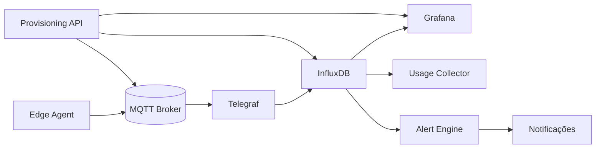

# Plano de Viabilidade SaaS IoT Industrial

## 1. Visão & Objetivo
Transformar o pipeline edge atual (PLC -> MQTT -> Telegraf -> InfluxDB -> Grafana) em uma plataforma SaaS multi-tenant para monitoramento, análise e alerta de ativos industriais, oferecendo baixo tempo de ativação e insights operacionais (qualidade, disponibilidade, energia, vibração).

## 2. Proposta de Valor
- Redução de tempo de implantação: de semanas para horas via provisioning automatizado.
- Observabilidade em tempo real de múltiplos sites (tenants) e linhas de produção.
- Alertas inteligentes (threshold + ausência + anomalia) reduzindo MTTR.
- Base para modelos preditivos (falha, qualidade, OEE) usando dados históricos estruturados.
- Custos operacionais controlados por retenção/dowsampling e quotas por plano.

## 3. Segmentos de Cliente
- Fábricas de médio porte com parque legado (PLC antigos sem integração moderna).
- Integradores industriais buscando acelerar entrega de dashboards/monitoramento.
- OEMs querendo oferecer monitoração remota de máquinas.

## 4. Personas Principais
| Persona | Necessidade | Métrica de Sucesso |
|---------|-------------|--------------------|
| Gestor Produção | Visibilidade OEE em tempo real | Aumento OEE / redução paradas |
| Eng. Manutenção | Alertas antecipados de falhas | Redução falhas não planejadas |
| Analista Qualidade | Correlação qualidade vs parâmetros processo | Redução retrabalho |
| Integrador | Provisionamento rápido multi-site | Nº sites ativados / mês |

## 5. Requisitos Funcionais (Faseadas)
| Fase | Requisito | Descrição |
|------|-----------|-----------|
| MVP | Multi-tenant básico | Identificação tenant/plc, isolamento lógico, autenticação básica |
| MVP | Dashboards padrão | Saúde PLC, métricas processo, latências |
| MVP | Alertas básicos | Threshold + ausência de heartbeat |
| MVP | Provisioning API | CRUD tenant, device, gerar token leitura |
| MVP | Quotas simples | Limite de dispositivos e pontos por plano |
| F1 | Retenção diferenciada | Buckets com políticas por plano |
| F1 | Downsampling automático | Tarefas Flux / pipeline aggregator |
| F1 | Auditoria | Log de ações provisioning |
| F2 | Billing / Uso | Métricas consumo vs plano |
| F2 | Alert Engine avançado | Rate change, composições |
| F2 | Anomalia ML inicial | Detecção simples (IQR / z-score) |
| F3 | Predictive Models | Falha / qualidade (regressão, anomaly advanced) |
| F3 | RBAC granular | Papéis (admin, viewer, maint) por tenant |

## 6. Requisitos Não Funcionais
| Categoria | Item | Meta |
|-----------|------|------|
| Disponibilidade | Uptime | >= 99% tiers pagos |
| Escalabilidade | Tenants suportados | 500 (MVP alvo 20) |
| Latência | Ingestão edge->dashboard | <5s (95p) |
| Segurança | Isolamento dados | Sem vazamento cross-tenant |
| Observabilidade | Métricas internas | Export de métricas por tenant |
| Custo | Custo infra / tenant | < US$15/mês (MVP) |
| Suporte | Tempo resposta incidente crítico | < 4h |

## 7. Arquitetura Alvo (Resumo Evolutivo)
1. Edge Agents publicam JSON padronizado em MQTT (TLS + ACL por tenant).
2. Ingestão via Telegraf multi-tenant (topics plc/<tenant>/<device>). Processors derivam tags.
3. Buckets Influx por plano: raw curto, process agregado longo, cold storage externo.
4. Provisioning Service (API) gerencia tenants/devices/tokens e grava manifestos.
5. Alert Engine consome stream e aplica regras (threshold, absence, rate). Saída webhook/email.
6. Dashboard Service (Grafana + config as code) gera dashboards padronizados per tenant.
7. Usage & Quotas: job extrai cardinalidade, pontos/dia, bytes / tenant.
8. ML Stage (fases posteriores) treina modelos sobre histórico agregado.

Mermaid (alto nível):

## 8. Modelo de Dados Payload Edge (Resumo)
Campos padrão: timestamp, tenant_id, plc_id, db, valores (bool/int/float), heartbeat.
Tags primárias: tenant_id, plc_id, db.
Garantias: timestamp UTC, coerção tipos, precedence: JSON > derivado tópico.

## 9. Estratégia Multi-Tenant
- Identificador único tenant (slug curto).
- Prefixo de tópico MQTT plc/<tenant>/<device>.
- Buckets compartilhados (MVP) com tag tenant_id; evolução para buckets dedicados para planos Enterprise.
- Quotas: nº devices, pontos/min, storage retenção.
- Isolamento visual: pastas dashboards por tenant.

## 10. Provisionamento & Fluxo de Onboarding
1. Criar tenant (POST /tenants).
2. Criar devices (POST /tenants/{id}/devices) definindo plc_id, tipo.
3. Gerar token Influx leitura/escrita conforme plano.
4. Emitir credenciais MQTT (username pattern: t_{tenant}_{device}).
5. Entregar pacote de configuração (YAML) ao integrador.
6. Ativar dashboards automáticos.
Tempo alvo: < 2h do cadastro ao dashboard online.

## 11. Alert Engine (MVP)
- Regras threshold (field >/< valor por janela tempo).
- Regras absence (sem edge_up por Xs).
- Persistência configuração por tenant.
- Execução em tarefas periódicas + avaliador streaming.

## 12. Métricas & KPIs Plataforma
| KPI | Fórmula | Objetivo |
|-----|---------|----------|
| Tenants Ativos | count(tenants com ingestão 24h) | Crescimento 10% m/m |
| MTTR Alerta | avg(tempo resolução alertas críticos) | -20% em 6m |
| Latência Edge->Influx | p95(diff timestamps) | <5s |
| Custos vs Receita | (Infra Mês)/(MRR) | < 40% |
| Retenção Dados Úteis | % consultas completadas <2s | >90% |
| Uso Quota | pontos_dia / quota_pontos_dia | <= 80% |

## 13. Segurança
- TLS obrigatório em MQTT e HTTP (externo).
- Tokens Influx de privilégios mínimos (r/w buckets necessários).
- Rotação semestral credenciais automáticas.
- Rate limiting API provisioning.
- Logs auditoria (ações CRUD) para compliance.

## 14. Custos Estimados (MVP 20 tenants)
| Item | Quantidade | Custo Unit | Total |
|------|------------|------------|-------|
| VM Edge Hub | 1 (4 vCPU / 8GB) | US$40 | 40 |
| InfluxDB Cloud/VM | 1 | US$60 | 60 |
| Grafana | 1 | US$20 | 20 |
| MQTT Broker | compartilhado | 10 | 10 |
| Storage (250GB) | 250GB | 0.10/GB | 25 |
| Backup & Snapshots | - | 15 | 15 |
| Total Infra | - | - | 170 |
(Valores aproximados para referência; otimização posterior.)

## 15. Riscos & Mitigações
| Risco | Impacto | Mitigação |
|-------|---------|-----------|
| Explosão Cardinalidade | Custos altos / lentidão | Quotas, downsampling, monitor cardinalidade |
| Vazamento Cross-Tenant | Reputação / legal | Revisão ACL, testes isolação, política segurança |
| Latência Alta | Usuário perde confiança | Profiling ingestion, tuning batch/parallel |
| Escalabilidade Alertas | Atrasos eventos críticos | Arquit. assíncrona, fila e worker pool |
| Custo Nuvem | Margem reduzida | Otimizar retenção e compressão, tiers preço |

## 16. Roadmap Macro
| Trimestre | Principais Entregas |
|-----------|---------------------|
| Q1 | MVP SaaS: provisioning, multi-tenant básico, alertas threshold/absence |
| Q2 | Quotas, billing uso, downsampling auto, auditoria |
| Q3 | Alertas avançados, ML anomalia inicial, RBAC granular |
| Q4 | Modelos preditivos, integrações externas (ERP/MES) |

## 17. Critérios de Sucesso MVP
- >= 5 tenants ativos em 60 dias.
- Dashboard principal carregando <3s p95.
- Nenhum incidente de cruzamento de dados em produção.
- Alertas threshold disparando dentro de 10s da condição.

## 18. Próximos Passos
1. Formalizar TENANCY_MODEL.md.
2. Especificar PROVISIONING_API_SPEC.md.
3. Definir DATA_RETENTION_STRATEGY.md com políticas por plano.
4. Detalhar ALERT_ENGINE_SPEC.md.
5. Preparar PoC de quotas (coleta cardinalidade por tenant).

(Referências: ver OPERATIONS.md para rotinas, TENANCY_MODEL.md para isolamento, DATA_RETENTION_STRATEGY.md para políticas e ALERT_ENGINE_SPEC.md para alertas.)
