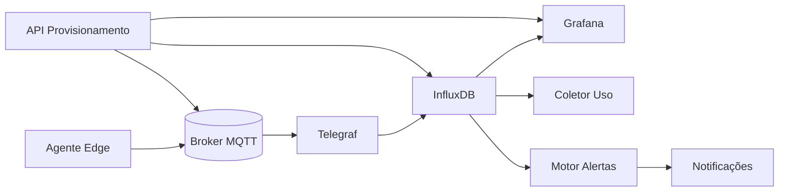

# Plano de Viabilidade SaaS IoT Industrial

## 1. Visão & Objetivo
Transformar o pipeline edge atual (PLC -> MQTT -> Telegraf -> InfluxDB -> Grafana) em uma plataforma SaaS multi‑locatários para monitoramento, análise e alerta de ativos industriais, oferecendo baixo tempo de ativação e insights operacionais (qualidade, disponibilidade, energia, vibração).

## 2. Proposta de Valor
- Redução de tempo de implantação: de semanas para horas via provisionamento automatizado.
- Observabilidade em tempo real de múltiplos sites (locatários) e linhas de produção.
- Alertas inteligentes (limiar + ausência + anomalia) reduzindo MTTR.
- Base para modelos preditivos (falha, qualidade, OEE) usando dados históricos estruturados.
- Custos operacionais controlados por retenção/downsampling e quotas por plano.

## 3. Segmentos de Cliente
- Fábricas de médio porte com parque legado (PLCs antigos sem integração moderna).
- Integradores industriais buscando acelerar entrega de dashboards/monitoramento.
- OEMs querendo oferecer monitoração remota de máquinas.

## 4. Personas Principais
| Persona | Necessidade | Métrica de Sucesso |
|---------|-------------|--------------------|
| Gestor de Produção | Visibilidade OEE em tempo real | Aumento OEE / redução paradas |
| Eng. de Manutenção | Alertas antecipados de falhas | Redução falhas não planejadas |
| Analista de Qualidade | Correlação qualidade vs parâmetros de processo | Redução retrabalho |
| Integrador | Provisionamento rápido multi‑site | Nº sites ativados / mês |

## 5. Requisitos Funcionais (Fases)
| Fase | Requisito | Descrição |
|------|-----------|-----------|
| MVP | Multi‑locatários básico | Identificação locatário/plc, isolamento lógico, autenticação básica |
| MVP | Dashboards padrão | Saúde PLC, métricas de processo, latências |
| MVP | Alertas básicos | Limiar + ausência de heartbeat |
| MVP | API de Provisionamento | CRUD locatário, dispositivo, gerar token leitura |
| MVP | Quotas simples | Limite de dispositivos e pontos por plano |
| F1 | Retenção diferenciada | Buckets com políticas por plano |
| F1 | Downsampling automático | Tarefas Flux / pipeline agregador |
| F1 | Auditoria | Log de ações de provisionamento |
| F2 | Faturamento / Uso | Métricas de consumo vs plano |
| F2 | Motor de Alertas avançado | Variação de taxa, composições |
| F2 | Anomalia ML inicial | Detecção simples (IQR / z‑score) |
| F3 | Modelos Preditivos | Falha / qualidade (regressão, anomalia avançada) |
| F3 | RBAC granular | Papéis (admin, viewer, maint) por locatário |

## 6. Requisitos Não Funcionais
| Categoria | Item | Meta |
|-----------|------|------|
| Disponibilidade | Uptime | >= 99% planos pagos |
| Escalabilidade | Locatários suportados | 500 (MVP alvo 20) |
| Latência | Ingestão edge->dashboard | <5s (p95) |
| Segurança | Isolamento de dados | Sem vazamento entre locatários |
| Observabilidade | Métricas internas | Exportar métricas por locatário |
| Custo | Custo infra / locatário | < US$15/mês (MVP) |
| Suporte | Tempo resposta incidente crítico | < 4h |

## 7. Arquitetura Alvo (Resumo Evolutivo)
1. Agentes Edge publicam JSON padronizado em MQTT (TLS + ACL por locatário).
2. Ingestão via Telegraf multi‑locatários (tópicos plc/<locatario>/<dispositivo>). Processors derivam tags.
3. Buckets Influx por plano: bruto curto, processado, agregado longo, armazenamento frio externo.
4. Serviço de Provisionamento (API) gerencia locatários/dispositivos/tokens e grava manifestos.
5. Motor de Alertas consome stream e aplica regras (limiar, ausência, variação). Saída webhook/email.
6. Serviço de Dashboards (Grafana + config as code) gera dashboards padronizados por locatário.
7. Uso & Quotas: job extrai cardinalidade, pontos/dia, bytes / locatário.
8. Estágio ML (fases posteriores) treina modelos sobre histórico agregado.

Mermaid (alto nível):

## 8. Modelo de Dados Payload Edge (Resumo)
Campos padrão: timestamp, locatario_id (tenant_id), plc_id, db, valores (bool/int/float), heartbeat.
Tags primárias: locatario_id, plc_id, db.
Garantias: timestamp UTC, coerção de tipos, precedência: JSON > derivado do tópico.

## 9. Estratégia Multi‑Locatários
- Identificador único do locatário (slug curto).
- Prefixo de tópico MQTT plc/<locatario>/<dispositivo>.
- Buckets compartilhados (MVP) com tag locatario_id; evolução para buckets dedicados para planos Enterprise.
- Quotas: nº dispositivos, pontos/min, retenção de storage.
- Isolamento visual: pastas de dashboards por locatário.

## 10. Provisionamento & Fluxo de Onboarding
1. Criar locatário (POST /tenants).
2. Criar dispositivos (POST /tenants/{id}/devices) definindo plc_id, tipo.
3. Gerar token Influx leitura/escrita conforme plano.
4. Emitir credenciais MQTT (padrão usuário: t_{locatario}_{dispositivo}).
5. Entregar pacote de configuração (YAML) ao integrador.
6. Ativar dashboards automáticos.
Tempo alvo: < 2h da criação ao dashboard online.

## 11. Motor de Alertas (MVP)
- Regras de limiar (campo >/< valor por janela de tempo).
- Regras de ausência (sem edge_up por Xs).
- Persistência de configuração por locatário.
- Execução em tarefas periódicas + avaliador streaming.

## 12. Métricas & KPIs da Plataforma
| KPI | Fórmula | Objetivo |
|-----|---------|----------|
| Locatários Ativos | count(locatarios com ingestão 24h) | Crescimento 10% m/m |
| MTTR Alerta | média(tempo resolução alertas críticos) | -20% em 6m |
| Latência Edge->Influx | p95(diff timestamps) | <5s |
| Custos vs Receita | (Infra Mês)/(MRR) | < 40% |
| Retenção Consultas Rápidas | % consultas <2s | >90% |
| Uso Quota | pontos_dia / quota_pontos_dia | <= 80% |

## 13. Segurança
- TLS obrigatório em MQTT e HTTP (externo).
- Tokens Influx com privilégios mínimos (r/w buckets necessários).
- Rotação semestral de credenciais automáticas.
- Rate limiting na API de provisionamento.
- Logs de auditoria (ações CRUD) para compliance.

## 14. Custos Estimados (MVP 20 locatários)
| Item | Quantidade | Custo Unit | Total |
|------|------------|------------|-------|
| VM Hub Edge | 1 (4 vCPU / 8GB) | US$40 | 40 |
| InfluxDB Cloud/VM | 1 | US$60 | 60 |
| Grafana | 1 | US$20 | 20 |
| Broker MQTT | compartilhado | 10 | 10 |
| Storage (250GB) | 250GB | 0.10/GB | 25 |
| Backup & Snapshots | - | 15 | 15 |
| Total Infra | - | - | 170 |
(Valores aproximados para referência; otimização posterior.)

## 15. Riscos & Mitigações
| Risco | Impacto | Mitigação |
|-------|---------|-----------|
| Explosão de Cardinalidade | Custos altos / lentidão | Quotas, downsampling, monitor cardinalidade |
| Vazamento Entre Locatários | Reputação / legal | Revisão ACL, testes de isolamento, política de segurança |
| Latência Alta | Usuário perde confiança | Profiling ingestão, ajuste batch/parallel |
| Escalabilidade de Alertas | Atrasos eventos críticos | Arquitetura assíncrona, fila e pool de workers |
| Custo Nuvem | Margem reduzida | Otimizar retenção e compressão, tiers de preço |

## 16. Roadmap Macro
| Trimestre | Principais Entregas |
|-----------|---------------------|
| Q1 | MVP SaaS: provisionamento, multi‑locatários básico, alertas limiar/ausência |
| Q2 | Quotas, faturamento uso, downsampling automático, auditoria |
| Q3 | Alertas avançados, ML anomalia inicial, RBAC granular |
| Q4 | Modelos preditivos, integrações externas (ERP/MES) |

## 17. Critérios de Sucesso do MVP
- >= 5 locatários ativos em 60 dias.
- Dashboard principal carregando <3s p95.
- Nenhum incidente de cruzamento de dados em produção.
- Alertas de limiar disparando dentro de 10s da condição.

## 18. Próximos Passos
1. Formalizar MODELO_MULTI_LOCATARIOS.md.
2. Especificar ESPECIFICACAO_API_PROVISIONAMENTO.md.
3. Definir ESTRATEGIA_RETENCAO_DADOS.md com políticas por plano.
4. Detalhar ESPECIFICACAO_MOTOR_ALERTAS.md.
5. Preparar PoC de quotas (coleta cardinalidade por locatário).

(Referências: ver OPERACOES.md para rotinas, MODELO_MULTI_LOCATARIOS.md para isolamento, ESTRATEGIA_RETENCAO_DADOS.md para políticas, ESPECIFICACAO_MOTOR_ALERTAS.md para alertas e ANALISE_GAPS.md para priorização.)